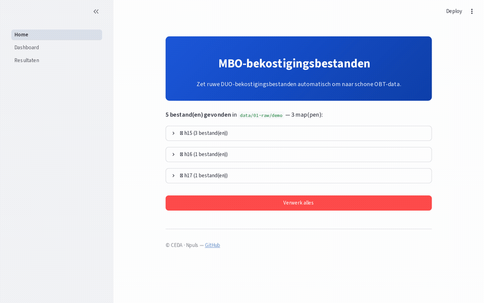
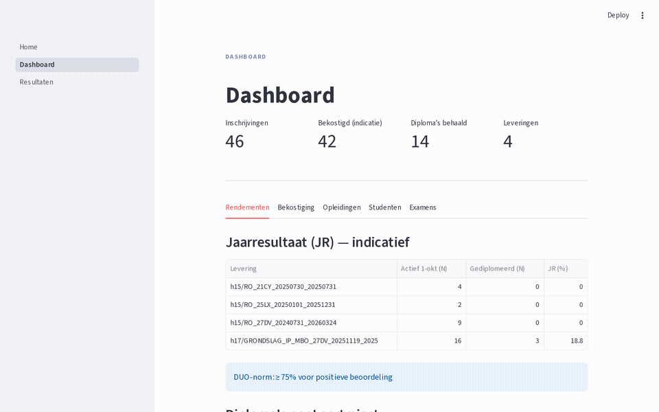
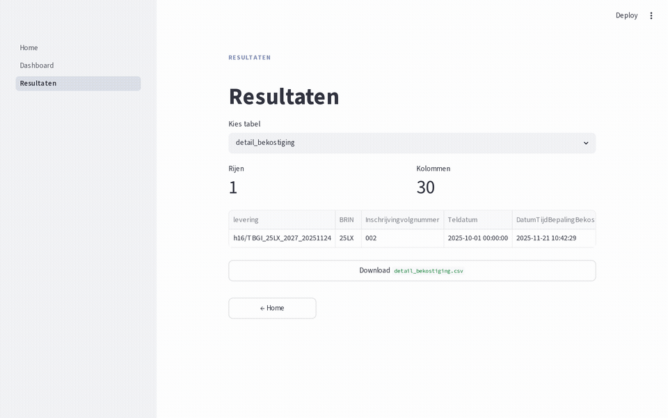

# mbo-bekostiging-bestanden

Leest DUO MBO-bekostigingsbestanden in en zet ze om naar schone, onderzoeksklare data.

## Context

MBO-instellingen worden bekostigd op basis van bestanden die DUO publiceert. Die
bestanden zijn ruw en lastig direct te gebruiken. Deze repo leest ze in,
decodeert de velden, controleert de kwaliteit en bouwt er één platte tabel van
(OBT) waarop andere CEDA-projecten kunnen voortbouwen.

Doelgroep: analisten en onderzoekers bij mbo-instellingen die met
bekostigingsdata werken.

## Quick start

```bash
uv sync
uv run streamlit run app/main.py
```

De repo bevat demo-data, zodat alles direct werkt zonder eigen bestanden.

---

### Stap 1 — Bestanden verwerken

Open de app, bekijk de ontdekte bestanden en klik **Verwerk alles**. De pipeline
normaliseert alle ruw DUO-bestanden naar Parquet en bouwt de gecombineerde OBT.



### Stap 2 — Dashboard

Na de verwerking toont het Dashboard een visueel overzicht verdeeld over vijf
tabs: rendementen (JR), bekostigingstrechter, opleidingen (BOL/BBL, BPV, KZD),
studenten (geslacht, herkomst, gemeente) en GEO-examencijfers.



### Stap 3 — Resultaten bekijken en downloaden

Op de Resultaten-pagina selecteer je een van de output-tabellen (OBT,
detail-tabellen of star-schema), bekijk je een preview van de eerste 1 000 rijen
en download je de volledige tabel als CSV.



---

**CLI**:

```bash
# Verwerk één ruw bestand naar prepared
uv run mbo verwerk data/01-raw/demo/h15/RO_27DV_20240731_20260324.csv \
    data/02-prepared/demo/h15/RO_27DV_20240731_20260324

# Bouw OBT vanuit meerdere prepared-mappen
uv run mbo obt \
    data/02-prepared/demo/h15/RO_27DV_20240731_20260324 \
    data/02-prepared/demo/h16/TBGI_25LX_2027_20251124 \
    data/02-prepared/demo/h17/GRONDSLAG_IP_MBO_27DV_20251119_2025 \
    --output data/03-output/demo/obt \
    --relative-to data/02-prepared/demo
```

**CLI**:

```bash
# Verwerk één ruw bestand naar prepared
uv run mbo verwerk data/01-raw/demo/h15/RO_27DV_20240731_20260324.csv \
    data/02-prepared/demo/h15/RO_27DV_20240731_20260324

# Bouw OBT vanuit meerdere prepared-mappen
uv run mbo obt \
    data/02-prepared/demo/h15/RO_27DV_20240731_20260324 \
    data/02-prepared/demo/h16/TBGI_25LX_2027_20251124 \
    data/02-prepared/demo/h17/GRONDSLAG_IP_MBO_27DV_20251119_2025 \
    --output data/03-output/demo/obt \
    --relative-to data/02-prepared/demo
```

**Python API**:

```python
from mbo_bekostiging_bestanden.pipeline import run_auto_pipeline, run_obt

run_auto_pipeline("data/01-raw/demo/h15/RO_27DV_20240731_20260324.csv",
                  "data/02-prepared/demo/h15/RO_27DV_20240731_20260324")

obt = run_obt(
    sources=["data/02-prepared/demo/h15/RO_27DV_20240731_20260324",
             "data/02-prepared/demo/h16/TBGI_25LX_2027_20251124",
             "data/02-prepared/demo/h17/GRONDSLAG_IP_MBO_27DV_20251119_2025"],
    target="data/03-output/demo/obt",
    relative_to="data/02-prepared/demo",
    star=True,  # exporteer ook dimensionaal model naar datamodel/
)
# obt["obt_inschrijvingen"]  — één rij per inschrijvingsperiode (ISP)
```

### Eigen data verwerken

Wijs `app/config.toml` naar je eigen mappen en draai dezelfde stappen:

```toml
[data]
raw = "data/01-raw/eigen"
prepared = "data/02-prepared/eigen"
output = "data/03-output/eigen"
```

Zet je ruwe DUO-bestanden (`RO_*.csv`, `TBGI_*.XML`, `GRONDSLAG_IP_MBO_*.csv`) in
de `raw`-map. De app ontdekt en verwerkt ze automatisch. Echte data staat niet in
git.

## Data

- **Input**: ruwe bekostigingsbestanden in `data/01-raw/`. Drie typen:
  `RO_*.csv` (h15), `TBGI_*.XML` (h16), `GRONDSLAG_IP_MBO_*.csv` (h17).
- **Prepared**: genormaliseerde Parquet per recordtype in `data/02-prepared/`,
  één submap per leveringsbestand (`groep/bestandsstam/`).
- **Output**: vijf OBT-bestanden in `data/03-output/obt/`:
  - `obt_inschrijvingen` — grain = inschrijvingsperiode (ISP), joins naar ISG/PER/BPV/KZD/GEO ingebakken
  - `detail_bpv` — alle BPV-overeenkomsten (één rij per overeenkomst)
  - `detail_kzd_amo` — keuzedelen en AMvB-onderdelen
  - `detail_bekostiging` — bekostigingsdetail (BII-records / TBGI Teldatum)
  - `meta_leveringen` — metadata per leveringsbestand
  - `datamodel/` — optioneel star schema (dim/fact-tabellen, zie [docs/datamodel.md](docs/datamodel.md))
- Echte data staat niet in git; alleen demo-data in `data/*/demo/`.

## Ontwikkeling

```bash
uv run pytest       # tests
uv run ruff check   # lint
```

Open de repo in de devcontainer (VS Code / GitHub Codespaces) voor een kant-en-klare omgeving.

## Referenties

- Uitgebreide documentatie: [`docs/`](docs/index.md)
- Technische context: [`CLAUDE.md`](CLAUDE.md)
- CEDA-standaarden: https://github.com/cedanl/.github/tree/main/standards/README.md

## Contact

Onderhouden door CEDA (cedanl). Bijdragen via issues en pull requests.

## License

MIT
