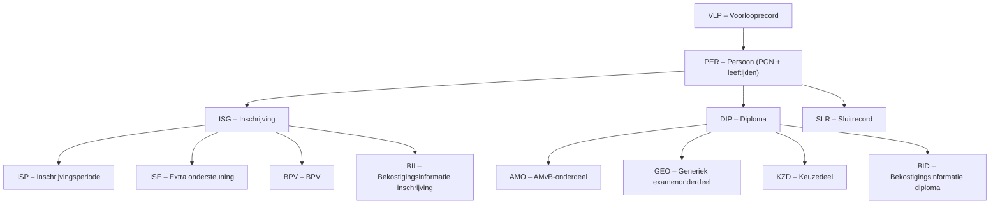

# GRONDSLAG IP MBO – Afslag register-levering

## Definitie

De GRONDSLAG IP MBO bevat de afslag van de register-levering aan IP (Instellingsplan) voor de ontvangende BRIN. Het bestand heeft dezelfde recordstructuur als het RO, maar aangevuld met **bekostigingsinformatie per inschrijving (BII) en per diploma (BID)**.

**Bestandsnaam:** `GRONDSLAG_IP_MBO_BRIN_AANMAAKDATUM_STUDIEJAAR.csv`

Voorbeeld: `GRONDSLAG_IP_MBO_27DV_20251119_2025.csv`

## Peildatum en tijdsbereik

- **Peildatum**: altijd 1 oktober van het lopende studiejaar
- **Inschrijvingen**: alle actieve inschrijvingen geldig op enig moment in het lopende studiejaar (1-8 t/m 31-7)
- **Diploma's**: behaald in het kalenderjaar van de peildatum
- **Losse onderdelen**: datum behaald in het studiejaar

## Privacyverschillen t.o.v. RO

| Gegeven | RO | GRONDSLAG IP |
|---|---|---|
| Persoonsidentificatie | BSN of ONR | **PGN** (pseudonummer) |
| Leeftijdsgegeven | Geboortedatum | **Vier leeftijden** op vaste meetmomenten |
| Geboorteland | Niet aanwezig | Aanwezig |
| Verblijfstitel | Niet aanwezig | Aanwezig |
| Nationaliteit | Niet aanwezig | Aanwezig |

## Technisch formaat

| Eigenschap | Waarde |
|---|---|
| Formaat | CSV, multi-record |
| Separator | `;` |
| Datumformaat | `ccyymmdd` (compact, zonder koppeltekens) |
| Karakterset | UTF-8 |
| Kolomkoppen | Nee |
| Eerste veld | Altijd recordtype-code |

## Bestandsnaam decoderen

```
GRONDSLAG_IP_MBO _ 99XX _ EEJJMMDD _ SSSS .csv
                   ^^^^   ^^^^^^^^   ^^^^
                   BRIN   aanmaakdatum  studiejaar
```

## Recordvolgorde



Per persoon (`PER`):

1. Nul of meer `ISG`-records; na elk ISG volgen:
    - Eén of meer `ISP`-records
    - Nul of meer `ISE`-records
    - Nul of meer `BPV`-records
    - Nul of meer `BII`-records
2. Nul of meer `DIP`-records; na elk DIP volgen:
    - Nul of meer `AMO`-records
    - Nul of meer `GEO`-records
    - Nul of meer `KZD`-records
    - Nul of meer `BID`-records
3. Nul of meer losse `AMO`, `GEO`, `KZD`-records

## Recordtypes

| Code | Naam | Uniek voor GRONDSLAG | Beschrijving |
|---|---|---|---|
| `VLP` | Voorlooprecord | | Studiejaar, aanmaakdatum, bekostigingstype (V/D) |
| `PER` | Persoon | | PGN + vier leeftijden, geslacht, postcode, nationaliteit |
| `ISG` | Inschrijving | | Inschrijvings- en uitschrijvingsdatum |
| `ISP` | Inschrijvingsperiode | | Opleiding, leertraject, niveau, indicatie bekostigbaar |
| `ISE` | Extra ondersteuning | | Periode extra ondersteuning |
| `BPV` | BPV | | BPV-overeenkomst, leerbedrijf, datums |
| `BII` | Bekostigingsinformatie inschrijving | ✓ | Teldatum, factoren, bijdrage deelnemerswaarde |
| `DIP` | Diploma | | Opleiding, behaaldatum, indicatie bekostigbaar |
| `BID` | Bekostigingsinformatie diploma | ✓ | Niveau, factoren, bijdrage diplomawaarde |
| `AMO` | AMvB-onderdeel | | Examenonderdeel bij diploma of los |
| `GEO` | Generiek examenonderdeel | | Taal/rekenen resultaten |
| `KZD` | Keuzedeel | | Keuzedeel resultaten |
| `SLR` | Sluitrecord | | Tellingen per recordtype |

## Sorteerorde

PER-records zijn oplopend gesorteerd op **PGN** (pseudonummer).

## Voorbeeld (demo-data 27DV, studiejaar 2025)

```
VLP;27DV;2025;20251119;V
PER;BSN1;37;37;38;37;V;7425;;;;6030;6030;6030;;;0001;;7425;;0001;
ISG;BSN1;27DV;C3;20230130;20250129;20250116;08
ISP;BSN1;27DV;C3;20230130;20250116;25655;;BBL;;1;100A501;101X591;;
BPV;BSN1;27DV;C3;C1;20230107;20230201;20250129;20240830;2163;100018965;25655;
DIP;BSN1;27DV;8286771;25655;20250116;1;C3;100A501
GEO;BSN1;27DV;8286771;8286774;3005;6;MBO;74;MBO;51;MBO;;;
KZD;BSN1;27DV;8286771;8286772;K0067;BEHAALD;;;;
SLR;14027;15415;23093;1;21410;0;3238;0;86;7302;7622
```

!!! note "BII en BID in demo-data"
    In de meegeleverde demo-data zijn geen BII- en BID-records aanwezig. Deze records worden door DUO gevuld na de bekostigingsberekening. In productiedata staan ze na respectievelijk het ISG- en DIP-record van de betreffende student.
