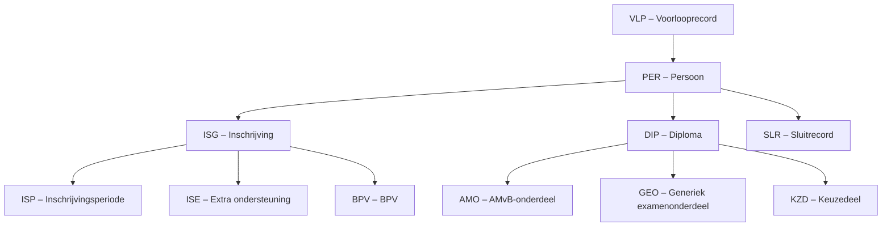

# RO – Registratieoverzicht

## Definitie

Het Registratieoverzicht (RO) bevat alle inschrijvingen (deelnames) en diploma's (resultaten) die geldig zijn in de door de instelling opgegeven **selectieperiode**. De instelling vraagt het RO zelf aan bij DUO.

**Bestandsnaam:** `RO_BRIN_BEGINDATUM_EINDDATUM.CSV`

Voorbeeld: `RO_27DV_20240731_20260324.CSV`

## Inhoud

- Alle inschrijvingen die geldig zijn in de opgegeven selectieperiode. Hierbij worden alle bijbehorende inschrijvingsperiodes, periodes extra ondersteuning en BPV's opgenomen.
- Alle diploma's inclusief bijbehorende resultaten behaald in de opgegeven selectieperiode.
- Alle losse resultaten (AMO, GEO, KZD) behaald in de selectieperiode.
- Alle resultaten die via het inschrijvingsvolgnummer gerelateerd zijn aan geselecteerde inschrijvingen en die niet in de selectieperiode zijn behaald.
- Alle personen waarvoor een inschrijving of diploma in het RO is opgenomen.
- Een sluitrecord met aantallen.

## Technisch formaat

| Eigenschap | Waarde |
|---|---|
| Formaat | CSV, multi-record |
| Separator | Varieert per instelling: `|` of `;` |
| Datumformaat | `ccyy-mm-dd` of `dd-m-yyyy` (varieert per instelling) |
| Karakterset | UTF-8 |
| Kolomkoppen | Nee |
| Eerste veld | Altijd recordtype-code |

!!! note "Separator varieert"
    Het technisch PvE schrijft `|` voor als veldscheidingsteken. In de praktijk leveren sommige instellingen het bestand met `;`. Parseer op beide varianten.

## Bestandsnaam decoderen

```
RO _ 99XX _ EEJJMMDD _ EEJJMMDD .CSV
     ^^^^   ^^^^^^^^   ^^^^^^^^
     BRIN   begindatum  einddatum selectieperiode
```

## Recordvolgorde



Per persoon (`PER`):

1. Nul, één of meer `ISG`-records; na elk ISG volgen:
    - Eén of meer `ISP`-records
    - Nul of meer `ISE`-records
    - Nul of meer `BPV`-records
2. Nul of meer `DIP`-records; na elk DIP volgen:
    - Nul of meer `AMO`-records
    - Nul of meer `GEO`-records
    - Nul of meer `KZD`-records
3. Nul of meer losse `AMO`, `GEO`, `KZD`-records

## Recordtypes

| Code | Naam | Beschrijving |
|---|---|---|
| `VLP` | Voorlooprecord | Bestandskop met BRIN en selectieperiode |
| `PER` | Persoon | BSN of ONR, geboortedatum, geslacht |
| `ISG` | Inschrijving | Inschrijvings- en uitschrijvingsdatum, reden uitschrijving |
| `ISP` | Inschrijvingsperiode | Opleiding, leertraject, niveau, bekostigbaarheidsindicatie |
| `ISE` | Extra ondersteuning | Periode extra ondersteuning |
| `BPV` | Beroepspraktijkvorming | BPV-overeenkomst, leerbedrijf, datums |
| `DIP` | Diploma | Opleiding, behaaldatum, bekostigbaarheidsindicatie |
| `AMO` | AMvB-onderdeel | Examenonderdeel bij diploma of los |
| `GEO` | Generiek examenonderdeel | Taal/rekenen resultaten |
| `KZD` | Keuzedeel | Keuzedeel resultaten |
| `SLR` | Sluitrecord | Tellingen per recordtype |

## Sorteerorde

PER-records zijn oplopend gesorteerd op BSN. Records zonder BSN (alleen onderwijsnummer) staan achteraan.

## Voorbeeld (demo-data 27DV)

```
VLP|27DV|2024-07-31|2026-03-24|2026-03-25
PER|BSN1||1987-11-23|V
ISG|BSN1||C3|2023-01-30|2025-01-29|2025-01-16|08
ISP|BSN1||C3|2023-01-30|25655|BBL||J||100A501|101X591||
BPV|BSN1||C3|C1|2023-01-07|2023-02-01|2025-01-29|2024-08-30|2163|100018965|25655|
DIP|BSN1||8286771|25655|2025-01-16||J|C3|100A501
GEO|BSN1||8286771|25655|8286774|3005||6|MBO|74|MBO|51|MBO||
KZD|BSN1||8286771|25655|8286772|K0067||Behaald|||
SLR|16616|19859|31053|2|28260|4696|133|11758|11511
```
